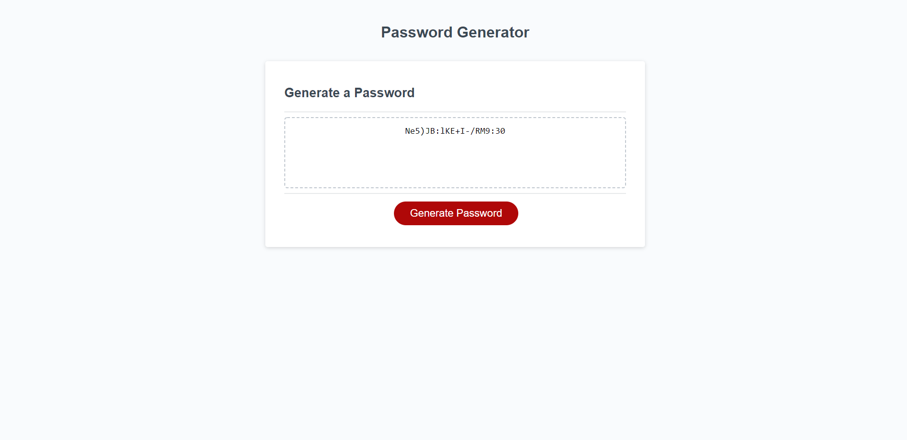

# Password Generator

## Description 
This project's main purpose is creating a random password per the users selected criteria. 
Once the information needed for the password is inputed it will create a password they can then copy and paste anywhere.

### Password Generator Explained
* When the 'Generate Password' button is clicked a prompt will pop up asking for the length of desired password
* Once length is selected and is inbetween 8-128, another prompt will pop asking the user if they desire Uppercase letters included
* This prompt will be asked 3 more times, asking for Lower case, Numbers, and Special Characters
* The password will then be randomized by adding all those charaters desired into a string.
* The password will then be written on the page

## Deployed Page
https://nandodavila.github.io/Password-Generator/

